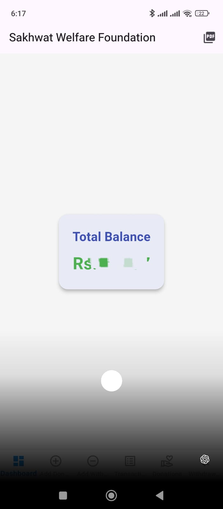
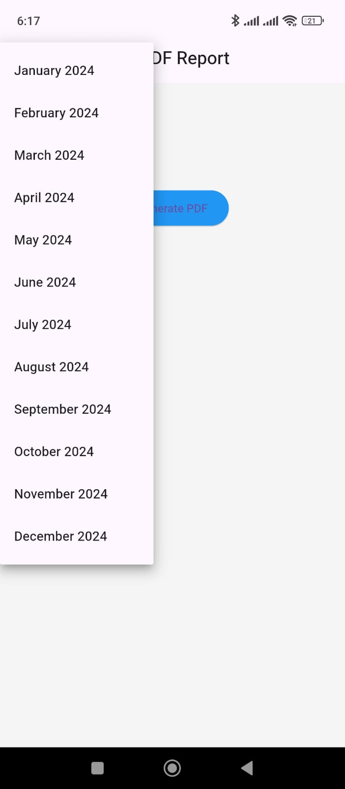
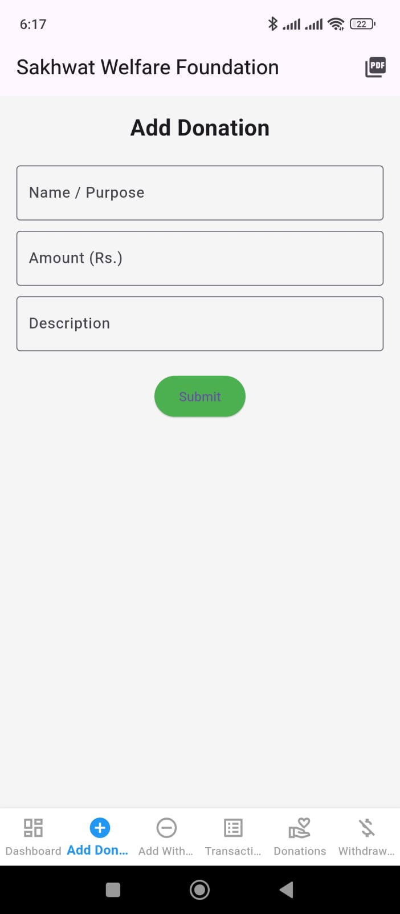
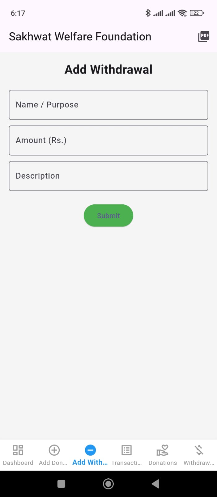
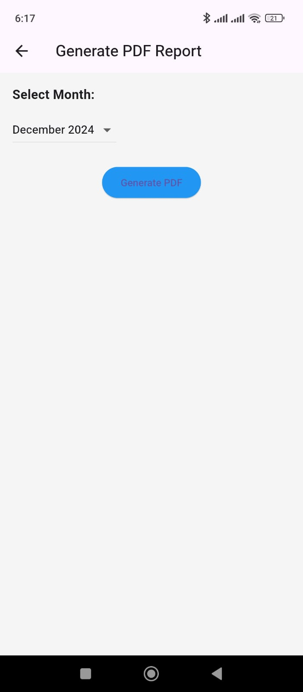
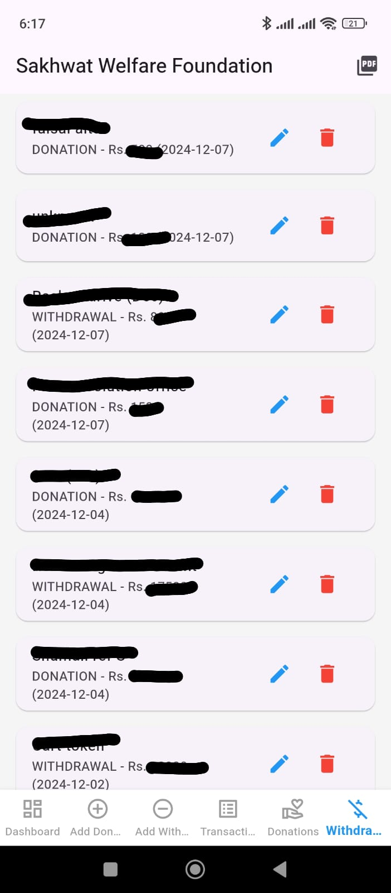

**📱 Charity App**

---

**🎯 Project Overview**

The **Charity App** is a Flutter-based mobile application designed to facilitate charitable giving and volunteering. Users can donate to campaigns, find volunteer opportunities, and track their impact in a seamless and intuitive way.

---

**✨ Features**

- **Donation Management** 💰  
  - Browse and donate to verified campaigns.  
  - Track donation history with transparency.

- **Volunteer Opportunities** 🙋‍♀️  
  - Discover and register for events near you.  
  - View upcoming and past events.

- **Campaign Creation** 📢  
  - Create, manage, and share fundraisers.  
  - Add images, goals, and real-time updates.

- **Impact Tracking** 📊  
  - Track how your donations and efforts are used.  
  - Get visual updates on campaign progress.

- **User Dashboard** 👤  
  - Personalized dashboard to manage donations, events, and settings.

---

**🛠️ Tech Stack**

- **Flutter** – Cross-platform UI development  
- **Firebase Authentication** – Secure user login  
- **Cloud Firestore** – Real-time database  
- **Provider** – State management  
- **flutter_animate** – For UI animations  
- **http** – For fetching external data  
- **SharedPreferences** – Persistent local storage

---

**📋 Installation & Setup**

1. Clone the repository  
   ```bash
   git clone https://github.com/fareedtariq16/charity-app.git
   ```

2. Navigate to the project folder  
   ```bash
   cd charity-app
   ```

3. Install dependencies  
   ```bash
   flutter pub get
   ```

4. Run the app  
   ```bash
   flutter run
   ```

---

**🧩 How to Use**

1. Sign up and create a profile.  
2. Browse campaigns or events.  
3. Donate or volunteer with just a few taps.  
4. Monitor your personal dashboard for activity and impact.

---

**📸 Screenshots**

|  |  |  |
|-----------------------------------|-----------------------------------|-----------------------------------|
|  |  |  |

---

**🎬 Video Demo**

<video width="100%" height="auto" controls style="max-width: 800px; display: block; margin: 20px auto;">
  <source src="screenshots/ab.mp4" type="video/mp4">
  Your browser does not support the video tag.
</video>


---

**📚 Resources**

- [Flutter Official Documentation](https://flutter.dev/docs)  
- [Firebase Firestore & Authentication](https://firebase.google.com/docs)  
- [Flutter State Management (Provider)](https://pub.dev/packages/provider)

---

**🤝 Contributing**

Feel free to fork the repository and contribute. Create a pull request for improvements or feature ideas. Let’s build a better world together.

---

**📝 License**

This project is licensed under the MIT License.
